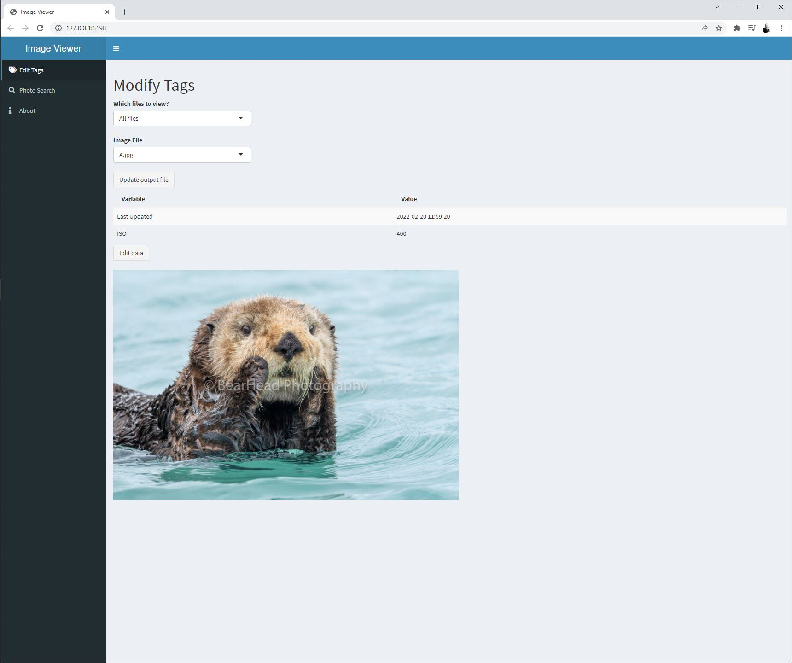

# (work in progress) Image Viewer

Shiny app that makes searching through photos easier.

## Personal Notes
Metadata handled by directory structure:
- Camera (canonet / etc)
- Camera type
- ISO
- Film Brand
- Film bw/color
- Roll number (show me all the images on that roll)

Tags:
- hasPeople
- Location (outside, inside)
- Scan type (self scan, place that scanned them)
- Scan date (approximate)
- Time of day (morning / afternoon / evening)

## Resources
- [Mastering Shiny](https://mastering-shiny.org/)
- [Outstanding User Interfaces with Shiny](https://unleash-shiny.rinterface.com/index.html)
- [fontAwesome search](https://fontawesome.com/v5/search?m=free&s=solid%2Cbrands)
- [htmltools](https://github.com/rstudio/htmltools)
- `htmltools::tags$` to see available html tags

## History

- 2-20-2022

